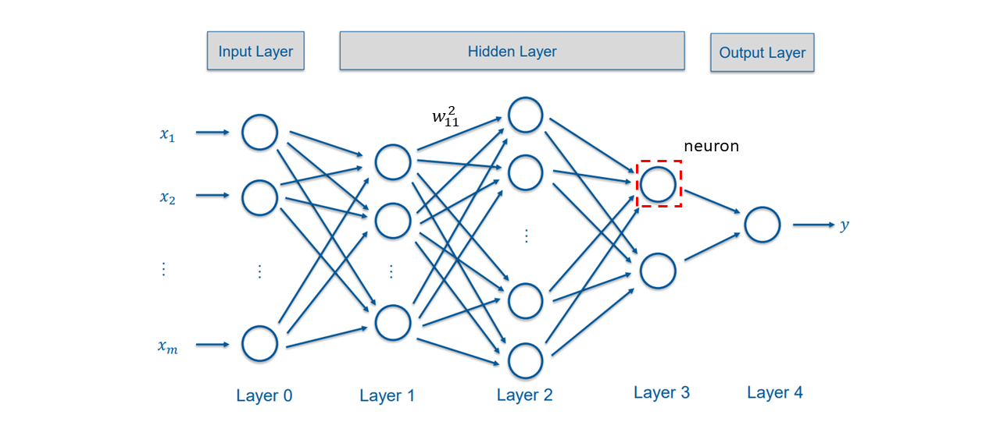
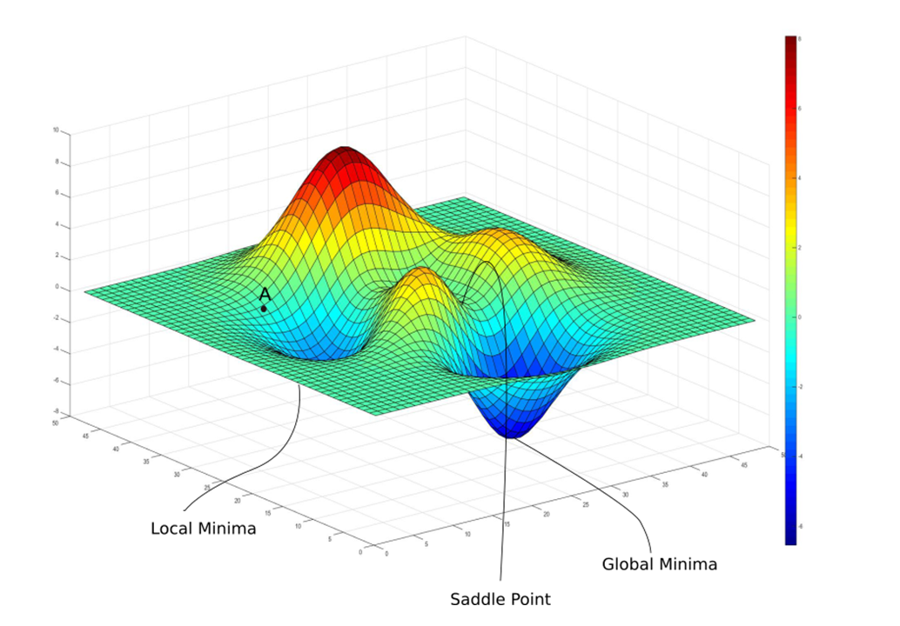
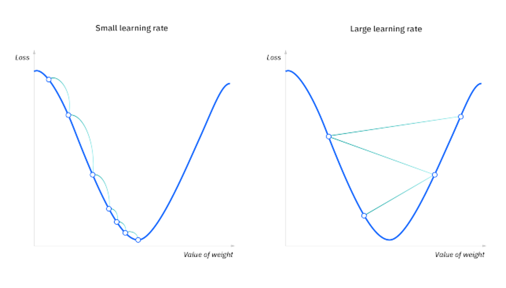
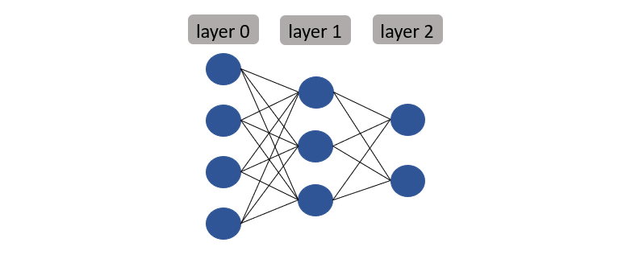
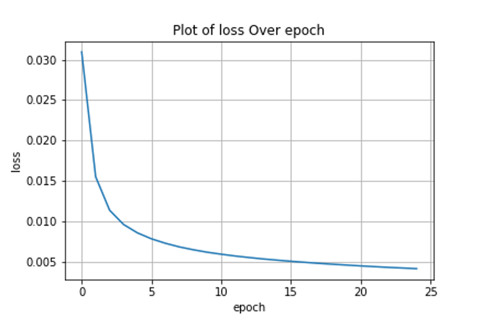

# NN_FromScratch
This project focuses on creating a Neural Network from scratch to gain a better understanding of fundamental concepts like feed forward, gradient descent, and backpropagation. The MNIST dataset is used for testing and validation.

* ## [1. Introduction](#1-Introduction)
* ## [2. Model Architecture](#2-Model-Architecture)
    * ### [2.1 Forward Pass](#21-Forward-Pass)
    * ### [2.2 Loss Function](#22-Loss-Function)
    * ### [2.3 Backpropagation](#23-Backpropagation)
    * ### [2.4 Gradient Descent](#24-Gradient-Descent)
* ## [3. Code Usage](#3-Code-Usage)
* ## [4. Model Training Results](#4-Model-Training-Results)
* ## [5. Acknowledgements](#5-Acknowledgements)

## <a name="1-Introduction">1. Introduction</a> 

In this project, we explore the construction of a simple feedforward Neural Network with customizable layers and neuron counts. Our primary objectives are to investigate and implement fundamental concepts, namely feedforward, gradient descent, and backpropagation. While this neural network constructor may be basic, it serves as an effective tool for comprehending these crucial topics in depth.

In addition to learning how to create a basic neural network, we will test it using the MNIST dataset to recognize handwritten digits and observe how our simple Neural Network performs with this well-known example.


## <a name="2-Model-Architecture">2. Model Architecture</a> 


A Feedforward Neural Network consists of layers composed of interconnected neurons, connected through weights. In this type of neural network, information can only move forward, without forming cycles or undergoing backward steps.




Each neuron has weights connected to it from the previous layer (except for the input) and another set connected to the next layer (except for the output). The nomenclature used is as follows:

- <sub style="font-size: 1.3em">$a_i^l$</sub>:  Activation of the $i$-th neuron in layer $𝑙$


- <sub style="font-size: 1.3em">$z_i^l$</sub>:  Pre-activation of the $i$-th neuron in layer $𝑙$ (before goes into activation function)


- <sub style="font-size: 1.3em">$w_{ij}^l$</sub>: Weight from $i$-th neuron in layer $(l-1)$ to $j$-th neuron in layer $l$


- <sub style="font-size: 1.3em">$b_i^l$</sub>:  Bias for neuron $i$ in layer $l$


The input layer is considered as $a^{(0)}$ and the output layer as $a^{(n)}$, where $n$ is the number of layers mimnus one.

The activation ($a$) and pre-activation ($z$) are given by: 

$$ z_j^{(l)} = \sum_{i=1}^{n_{l-1}} w_{ij}^{(l)} a_i^{(l-1)} + b_j^{(l)} $$

$$ a_j^{(l)} = f^{(l)}(z_j^{(l)}) $$

Where $n_{l-1}$ is the number of neurons in layer $𝑙 − 1$, and $f^{(l)}$ is the activation function for layer $l$.

---

### <a name="21-Forward-Pass">2.1 Forward Pass</a> 

The forward pass involves calculations performed throughout the neural network, from the input to the output. To perform the calculation, you need to compute the activation for each neuron and continue this process until you reach the output. For a specific layer, the activations are computed as follows:

$$a^{(l)} = f^{(l)}(  (𝑊^{(l)})^Ta^{(l-1)}+b^{(l)}  )$$

Where $W$ is the matrix for the weights of layer $l$, $a^{(l-1)}$ the vector of activations from layer $(l-1)$ and $b^{(l)}$ the vector of bias from layer $l$. The weight matrix, activation vector and bias vector are represented this way:


$$𝑊^{(l)} = 
\begin{bmatrix}
    w_{11}^{(𝑙)} & \cdots & w_{1n_𝑙}^{(𝑙)} \\
    \vdots & \ddots & \vdots \\
    w_{n_{𝑙-1}1}^{(𝑙)} & \cdots & w_{n_{𝑙-1}n_𝑙}^{(𝑙)} \\
\end{bmatrix}$$


$$a^{(𝑙)} =
\begin{bmatrix}
    a_1^{(𝑙)} \\
    \vdots \\
    a_{n_𝑙}^{(𝑙)}
\end{bmatrix}$$


$$b^{(𝑙)} =
\begin{bmatrix}
    b_1^{(𝑙)} \\
    \vdots \\
    b_{n_𝑙}^{(𝑙)}
\end{bmatrix}$$

The matrix $𝑊(𝑙)$ of dimension $𝑛_{𝑙−1} × 𝑛_𝑙$ contains the weights of the layer $𝑙$.

---


### <a name="22-Loss-Function">2.2 Loss Function</a> 


The Loss Function quantifies the difference between the predicted output and the actual target. The goal during training is to minimize this discrepancy. Common loss functions include Mean Squared Error (MSE) for regression tasks and Cross-Entropy Loss for classification problems. 
The loss function help us to see how far we are from our target, and its based on its value that we try to minimize.

---


### <a name="23-Backpropagation">2.3 Backpropagation</a> 

Backpropagation is the fundamental algorithm that enables neural networks to learn. It involves propagating the output error backward through the network and adjusting the weights and biases based on their respective contributions to the output. The key is to minimize the error between the output and the target.

The level of adjustment is determined by the gradients of the cost function concerning those parameters (weights or biases). Gradients are utilized due to their capability to measure the sensitivity of the output function concerning its variables.

$$\frac{\partial C}{\partial x}$$

* The derivative tells us the direction C is going.
* The gradient shows how much the parameter x needs to change (in positive or negative direction) to minimize C.

To facilitate error propagation throughout the network, we use the Chain Rule for derivatives. This method is particularly crucial in deep neural networks. An easy demostration of the chain rule is:

if $y=f(u)$, where $u=g(x)$, you can write:

$$\frac{d y}{d x} = \frac{d y}{d u}  \frac{d u}{d x}$$

To have a better understanding on this topic you can check this [page](https://www.khanacademy.org/math/ap-calculus-ab/ab-differentiation-2-new/ab-3-1a/v/chain-rule-introduction).
With the help of this chain rule we can use the backpropagation to calculate the gradient for each weight and bias in the entire network:

$$weights: \frac{d C}{d w_{11}^{(1)}}, \frac{d C}{d w_{12}^{(1)}}, ... , \frac{d C}{d w_{i(j-1)}^{(l)}}, \frac{d C}{d w_{ij}^{(l)}}$$


$$bias: \frac{d C}{d b_1^{(1)}}, \frac{d C}{d b_2^{(1)}}, ... , \frac{d C}{d b_{(j-1)}^{(l)}}, \frac{d C}{d b_{j}^{(l)}}$$


---


### <a name="24-Gradient-Descent">2.4 Gradient Descent</a> 

Gradient Descent is an optimization algorithm that is used to help train machine learning models. It makes use of the gradients computed by the backpropagation to update the value of weights and bias, always tending to minimize the loss function. This algorithm is used repetively in the trainning process to move the variables to a local minimal in the superficie of the loss function.



Even though the primary aim is to minimize the loss function significantly, achieving the global minimum isn't assured; the algorithm typically converges towards a local minimum, which might or might not be the global minimum. Techniques such as weight and bias initialization methods, along with optimization features like ADAM and momentum, can be employed to alleviate this issue.
Let's explore how the Gradient Descent algorithm utilizes gradients. To update a specific element, you follow this formula:

$$ x = x - \alpha \cdot \nabla L_x $$

- $x$ represents the specific weight or bias being updated.
- $\alpha$ denotes the learning rate, controlling the size of optimization steps.
- $\nabla L_x$ signifies the gradient of the loss function with respect to the weights or biases, indicating the direction and rate of the steepest change in the loss function.

The learning rate ($\alpha$) determines the size of steps taken to reach the minimum. Typically a small value, it's assessed and adjusted based on the cost function's behavior. Higher learning rates lead to larger steps, risking overshooting the minimum. Conversely, lower learning rates yield smaller step sizes.



You can also divide the way you update the elements using gradient descent in 3 main groups:

* Batch Gradient Descent

In this approach, the gradients for all points in the training dataset are summed up, and updates are made only after computing all of them. This method usually results in a smoother curve towards local minima but may demand significant time and memory due to the need to store all gradients before updating the values.

* Stochastic Gradient Descent

Stochastic Gradient Descent (SGD) updates the values after processing each input in the dataset. This technique is faster and requires less memory as updates occur after every forward pass. However, it can introduce considerable noise since each input modifies the elements related to its output, ignoring other samples.

* Mini-Batch Gradient Descent

This technique attempts to combine the advantages of the above methods. The training dataset is divided into smaller mini-datasets, and updates to weights and biases occur after processing each mini-batch.

---


## <a name="3-Code-Usage">3. Code Usage</a> 

I've designed a class called NeuralNetwork, requiring a list containing integers as input. Each element in the list represents a layer in the neural network, including both the input and output layers. The integer at each position signifies the number of neurons in that layer. Here's an example for clarification:

```python
nn = NeuralNetwork(layers=[4,3,2])
```


All weight and bias matrices are instances of this class, created during initialization. Both weight and bias matrices are generated using a random normal distribution with an average of 0 and a standard deviation of 1. 
You can also select the learning rate for the gradient descent update, but I've made it optional. The default value is $0.5$. The entire initialization function includes instances of activations, gradients, and the number of layers, built as shown in the following code snippet:

```python
class NeuralNetwork():
    def __init__(self, layers, learning_rate=.5):
        self.n_layers = len(layers)
        # Weights
        self.weights = [np.random.normal(loc=0.0, scale=1.0,
                        size=(layers[i], layers[i+1])) for i in range(len(layers)-1)]
        # Bias
        self.bias = [np.random.normal(loc=0.0, scale=1.0,
                     size=(i,)) for i in layers[1:]]
        # Learning rate
        self.learning_rate = learning_rate
        # Activations 
        self.a = []
        # Gradients
        self.grad_w = []
        self.grad_b = []
```

The forward pass only require the input data since all weights and biases are instantiated within the class. Additionally, for this project, I've employed the sigmoid activation function for all layers in the neural network.

To train the neural network, you'll only need the test data, the number of epochs, and the batch size, although I've left these last two as optional parameters with defaults of epochs=25 and batch_size=1. The function will return the epoch_loss and batch_loss.

```python
nn = NeuralNetwork([784, 32, 16, 10])
epoch_loss, batch_loss = nn.train(x_train, y_train, epochs=25, batch_size=20)
```

## <a name="4-Model-Training-Results">4. Model Training Results</a> 

I've conducted thorough tests using the MNIST dataset to evaluate the performance of the Neural Network. Below are some key findings from the training process:

Accuracy Assessment: The model achieved an accuracy of [93.46]% on the test dataset, showcasing its capability to make accurate predictions.

Loss Metrics: Throughout [25] epochs of training, the model demonstrated a consistent reduction in loss, indicating improved learning and convergence over time. The epoch-wise loss metrics are detailed below:

```python
Epoch 1/25 - Loss: 0.0310
Epoch 2/25 - Loss: 0.0156
Epoch 3/25 - Loss: 0.0114
Epoch 4/25 - Loss: 0.0097
Epoch 5/25 - Loss: 0.0086
Epoch 6/25 - Loss: 0.0079
Epoch 7/25 - Loss: 0.0073
Epoch 8/25 - Loss: 0.0069
Epoch 9/25 - Loss: 0.0065
Epoch 10/25 - Loss: 0.0062
Epoch 11/25 - Loss: 0.0060
Epoch 12/25 - Loss: 0.0058
Epoch 13/25 - Loss: 0.0056
Epoch 14/25 - Loss: 0.0054
Epoch 15/25 - Loss: 0.0053
Epoch 16/25 - Loss: 0.0051
Epoch 17/25 - Loss: 0.0050
Epoch 18/25 - Loss: 0.0049
Epoch 19/25 - Loss: 0.0048
Epoch 20/25 - Loss: 0.0047
Epoch 21/25 - Loss: 0.0046
Epoch 22/25 - Loss: 0.0045
Epoch 23/25 - Loss: 0.0044
Epoch 24/25 - Loss: 0.0043
Epoch 25/25 - Loss: 0.0042
```



## <a name="5-Acknowledgements">5. Acknowledgements</a> 

I'd like to provide some sources of inspiration and further study materials related to this project:

* [3Blue1Brown Series on Deep learning](https://www.youtube.com/watch?v=aircAruvnKk&list=PLZHQObOWTQDNU6R1_67000Dx_ZCJB-3pi)

* [DeepLearningAI Course](https://www.youtube.com/watch?v=CS4cs9xVecg&list=PLpFsSf5Dm-pd5d3rjNtIXUHT-v7bdaEIe)

* [DeepLizard course on Deep Learning](https://www.youtube.com/watch?v=gZmobeGL0Yg&list=PLZbbT5o_s2xq7LwI2y8_QtvuXZedL6tQU)
